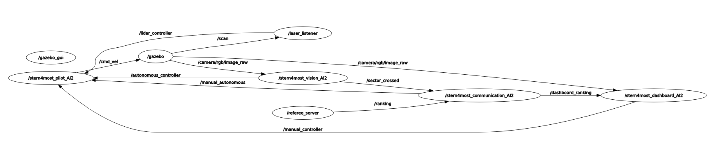

# AnR2021G02

<p align="center">
  
</p>

# Run

to run this project you have to get the [ROSNoeticDocker](https://github.com/PXLAIRobotics/ROSNoeticDocker.git)
clone this repo into the `/Projects/catkin_ws_src` directory

once inside run the following command to build the solution:

```bash
cd ~/Projects/catkin_ws && catkin_make --pkg referee && source devel/setup.bash
```

## Rommel

**RECOMMENDED** run the file `rommel.sh`

```bash
sh ~/Projects/catkin_ws/src/AnR2021G02/rommel.sh
```

alternative:

```bash
[terminal 1] $ rommel
[terminal 2] $ rosrun stern4most_pilot_AI2 stern4most_pilot_AI2.py
[terminal 3] $ rosrun stern4most_dashboard_AI2 stern4most_dashboard_AI2.py
[terminal 4] $ rosrun stern4most_lidar_AI2 stern4most_lidar_AI2.py
[terminal 5] $ rosrun stern4most_vision_AI2 stern4most_vision_AI2.py
[terminal 6] $ rosrun referee start_publisher.py
[terminal 7] $ rosrun referee referee_service.py
[terminal 8] $ rosrun stern4most_communication_AI2 stern4most_communication_AI2.py
```

## Backwards

**RECOMMENDED** run the file `backwards.sh`

```bash
sh ~/Projects/catkin_ws/src/AnR2021G02/backwards.sh
```

alternative:

```bash
[terminal 1] $ sternformost
[terminal 2] $ rosrun stern4most_pilot_AI2 stern4most_pilot_AI2.py
[terminal 3] $ rosrun stern4most_dashboard_AI2 stern4most_dashboard_AI2.py
[terminal 4] $ rosrun stern4most_vision_AI2 stern4most_vision_AI2.py
[terminal 5] $ rosrun referee start_publisher.py
[terminal 6] $ rosrun referee referee_service.py
[terminal 7] $ rosrun stern4most_communication_AI2 stern4most_communication_AI2.py
```

# Architecture

Our systems layout 

all systems work independently of eachother. When all systems are engagde the LIDAR is the master of the vision.
It will first avoid an obstacle and the vision will correct afterwards to stay on track.

# Kown issues

- 15% chance the car will avoid a object by going off track
- 30% chance on getting stuck on tree

# Extra

### Things we are proud of

- Implimented LIDAR system with no online resources
- Smoothness on cornering when driving backwards
- Smoothness on obstacle avoidance with LIDAR
- Decently documented code
