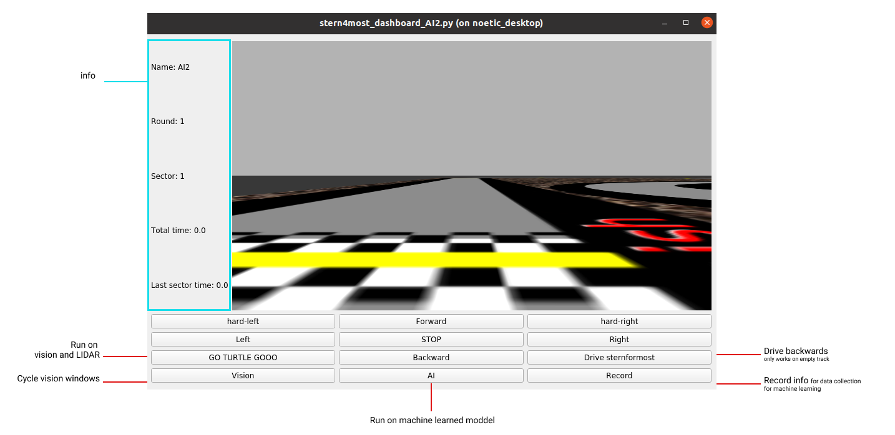
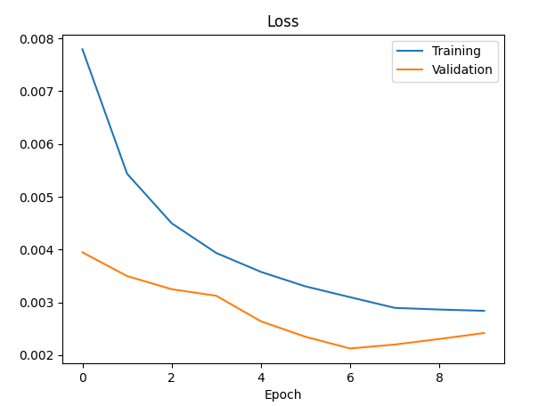

# AnR2021G02

<p align="center">
  
</p>

# Run

To run this project you have to get the [ROSNoeticDocker](https://github.com/PXLAIRobotics/ROSNoeticDocker.git).
Then, clone this repo into the `/Projects/catkin_ws_src` directory of the docker.

Our AI package uses multiple dependencies, so we also have to install these with pip. Pip is not installed so

```bash
sudo apt update && sudo apt install -y python3-pip
```

Afterwards, install the dependencies with

```
pip3 install -r requirements.txt
```

Once inside run the following command to build the solution:

```bash
cd ~/Projects/catkin_ws && catkin_make --pkg referee && source devel/setup.bash
```

## Rommel

**RECOMMENDED** run the file `rommel.sh`

```bash
sh ~/Projects/catkin_ws/src/AnR2021G02/rommel.sh
```

alternatively, you can manually execute the following commands in seperate terminals:

```bash
[terminal 1] $ rommel
[terminal 2] $ rosrun stern4most_pilot_AI2 stern4most_pilot_AI2.py
[terminal 3] $ rosrun stern4most_dashboard_AI2 stern4most_dashboard_AI2.py
[terminal 4] $ rosrun stern4most_lidar_AI2 stern4most_lidar_AI2.py
[terminal 5] $ rosrun stern4most_vision_AI2 stern4most_vision_AI2.py
[terminal 6] $ rosrun stern4most_AI_AI2 stern4most_AI_Record_AI2.py
[terminal 7] $ rosrun stern4most_AI_AI2 stern4most_AI_AI2.py
[terminal 8] $ rosrun referee start_publisher.py
[terminal 9] $ rosrun referee referee_service.py
[terminal 10] $ rosrun stern4most_communication_AI2 stern4most_communication_AI2.py
[terminal 11] $ rosrun referee start_publisher.py 1
```

## Backwards

**RECOMMENDED** run the file `backwards.sh`

```bash
sh ~/Projects/catkin_ws/src/AnR2021G02/backwards.sh
```

alternatively, you can manually execute the following commands in seperate terminals:

```bash
[terminal 1] $ sternformost
[terminal 2] $ rosrun stern4most_pilot_AI2 stern4most_pilot_AI2.py
[terminal 3] $ rosrun stern4most_dashboard_AI2 stern4most_dashboard_AI2.py
[terminal 4] $ rosrun stern4most_vision_AI2 stern4most_vision_AI2.py
[terminal 5] $ rosrun stern4most_AI_AI2 stern4most_AI_Record_AI2.py
[terminal 6] $ rosrun stern4most_AI_AI2 stern4most_AI_AI2.py
[terminal 7] $ rosrun referee start_publisher.py
[terminal 8] $ rosrun referee referee_service.py
[terminal 9] $ rosrun stern4most_communication_AI2 stern4most_communication_AI2.py
[terminal 10] $ rosrun referee start_publisher.py 1
```

# Architecture

This is our systems layout:


All systems work independently of eachother. When all systems are engagde the LIDAR is the master of the vision.
It will first avoid an obstacle, whereafter the vision will correct to stay on the track.

### Dashboard



# Known issues

- 15% chance the car will avoid a object by going off the track
- 30% chance on getting stuck on tree

# Extras

## Machine learning

in the last 2 days, we tried to get our hands dirty with machine learning. We did this because it didn't really look that difficult
and we wanted to try something different. [George Hotz](https://youtu.be/ZtpWTJ7Jsh8) was a big inspiration and motivation for this.

Our machine learning was done in 3 steps:

### Data collection

With data collection we created a module that collects our data. This data is the image seen by our turtlebot and the steering angle it currently has.
We can use this data to train. Our first dataset was made by driving from the start to the 6th sector of the track. We drove in both directions on this section to get 6000 images / datapoints.

this was done in `stern4most_AI_AI2/stern4most_AI_Record_AI2.py`

### Training

With the dataset we created, we started to train our model with the help of some online references. We used: scikit-learn and tensorflow for this training.
At the end of our training we had a loss function of 0.03. in our first attempt.



this was done in `training/training.py`

### Implementing

With our trained model, we implemented this very similarly as our vision module, the main difference being that we used our model to predict the steering angles. Our model was trained well enough on the small piece of the track to drive the rest of the track flawlessly as well.

---

### Things we are proud of

- Implemented LIDAR system with no online resources
- Implemented Machine learning
- Smoothness on cornering when driving backwards
- Smoothness on obstacle avoidance with LIDAR
- Decently documented code
- Mostly structured code

### Things we could have done better

- Better vision system
- LIDAR and vision working in symbiosis

---

### Full runs

#### Forwards rommel

<a href="https://youtu.be/CVHOaJUBfbA
" target="_blank"></a>

#### Backwards empty

<a href="https://youtu.be/0KUafmbeS6w
" target="_blank"></a>

#### Backwards rommel in under 5 min

<a href="https://youtu.be/dQw4w9WgXcQ
" target="_blank"></a>
